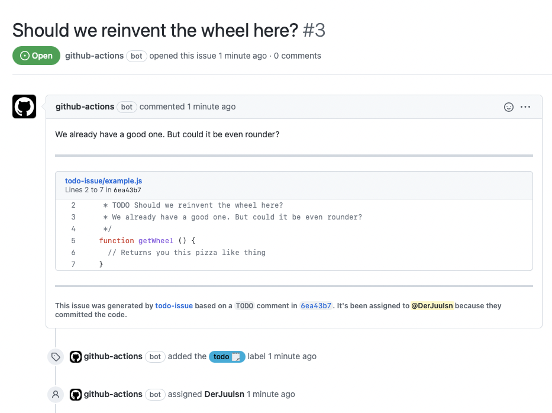

# todo-issue[action]

---

## Disclosure

Huge thanks to [JasonEtco](https://github.com/JasonEtco)! After he decided to shut down
his [todo[bot]](https://todo.jasonet.co/) I've looked around for alternatives but decided to create a new
implementation. Parts of his work can be found in this repository.

## Usage

The **todo-issue** action is super easy to use. Once you've [set up the action](#setup), simply push some code (via
commit or pull request). If the code you pushed includes one of the configured keywords (default is `TODO`), then the
action will either
**create** a new, **close**, **update** or **add a reference** to an existing issue for you using the comment you wrote
or changed in your code!

If I pushed this:

```js
/**
 * TODO Should we reinvent the wheel here?
 * We already have a good one. But could it be even rounder?
 */
function getWheel() {
    // Returns you this pizza like thing
}
```

**todo-issue** would create a new issue:



**Note:** While the above example is in javascript, **todo-issue** works in any language as long as you provide a
valid [styling](#Styling).

## Setup

There are a couple of [configuration options](#available-options) in case you need to change the default behaviour.

The defaults are likely fine for most projects, so you might not need to change them.

This yml is a good starting point. You should not tweak the triggers, except for the branch

```yml
name: Create issues from TODOs

on:
  workflow_dispatch:
    inputs:
      importAll:
        default: 'false'
        required: false
        type: boolean
        description: Enable, if you want to import all TODOs. Runs on checked out branch! Only use if you're sure what you are doing.
  push:
    branches: # do not set multiple branches, todos might be added and then get referenced by themselves in case of a merge
      - main
      - master

permissions:
  issues: write
  repository-projects: read
  contents: read

jobs:
  todos:
    runs-on: ubuntu-latest

    steps:
      - uses: actions/checkout@v2

      - name: Run Issue Bot
        uses: derjuulsn/todo-issue@main
        with:
          excludePattern: '^(node_modules/)'
        env:
          GITHUB_TOKEN: ${{ secrets.GITHUB_TOKEN }}
```

### Available options

| Name              | Type                        | Description                                                                                                                                                                                                                                       | Default    |
|-------------------|-----------------------------|---------------------------------------------------------------------------------------------------------------------------------------------------------------------------------------------------------------------------------------------------|------------|
| `autoAssign`      | `boolean, string[], string` | Should **todo-issue** automatically assign a user to the new issue? If `true`, it'll assign whoever pushed the code. If a string, it'll assign that user by username. You can also give it an array of usernames or `false` to not assign anyone. | `true`     |
| `keywords`        | `string[]`                  | The keyword(s) to use to generate issue titles                                                                                                                                                                                                    | `['TODO']` |
| `bodyKeywords`    | `string[]`                  | If this is in the line right after the main keyword, it will become the generated issue body.                                                                                                                                                     | `[]`       |
| `blobLines`       | `number, boolean`           | The max number of lines of code to show, starting from the line with the keyword. Can disable blob at all.                                                                                                                                        | `5`        |
| `blobLinesBefore` | `number`                    | The max number of lines of code to show before the line with the keyword.                                                                                                                                                                         | `0`        |
| `caseSensitive`   | `boolean`                   | Should the keyword be case sensitive?                                                                                                                                                                                                             | `true`     |
| `label`           | `boolean, string[]`         | Add a label to the new issue. If true, add the `todo` label. If false, don't add any label.You can also give it a label name or an array of label names.                                                                                          | `true`     |
| `reopenClosed`    | `boolean`                   | If an issue already exists and is closed, reopen it. Note: if set to false, no new issue will be created.                                                                                                                                         | `true`     |
| `excludePattern`  | `string`                    | Exclude certain files and/or directories. Should be a valid regular expression.                                                                                                                                                                   | `null`     |
| `titleSimilarity` | `number, false`             | Number in percent of similarity which should be used for merging issues on creation.                                                                                                                                                              | `80`       |

### Labels

Add labels with \[square brackets\] at the end of a comment, to tag your issue with these tag

```
// TODO make this button red [frontend]
// this button should be red to clearify something
```

The above comment will add a frontend label to your GitHub Issue

### Import all

There is also an option to import all TODOs to GitHub Issues by running the workflow manually in the actions tab.

**Note:** This can't be undone and should be used super carefully. Don't forget to set your exclude paths in the
excludePattern regex.

### Styling

There are not many things to pay attention to.

- In front of a keyword only symbols and whitespace are allowed
- If you want the body of a comment to be added to the issue, you have to use the exact same characters as in front of
  the title keyword

For instance this:

```
//+TODO We have to do something about this
//-there is an error at line 28
```

would result in a new issue without a body because `//+` is not equal to `//-` (also counts for whitespace!)
